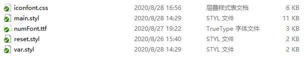

# 在微信小程序里使用自定义字体

不管在pc端还是移动端，开发一些图表统计或者数字显示的时候，往往UI效果里需要一些自定义字体来增加显示效果和美观度，各个系统提供的系统字体很难满足需求，比如下图中的数字展示，UI使用了一款叫“DINPro-Bold”的国外字体。

**web项目**

在web项目中，我们可以直接将字体文件放置在代码包中或者通过静态资源库下载，不过这样会增加代码包的大小。

**小程序项目**

在小程序中，微信有提供一个字体下载的接口 wx.loadFontFace：
```js
wx.loadFontFace({
  family: 'Bitstream Vera Serif Bold',
  source: 'url("https://sungd.github.io/Pacifico.ttf")',
  success: () => {
    console.log
  }
})
```

**存在的问题**

上面这些方案的缺点：要么增加了代码包大小，要么需要用户下载到本地。

对于这种我们仅仅只是为了数字展示的，其实是不需要整套字体字库文件的，尤其中文字库大的几十上百M，下载流量也费钱呀！

比如上图中的数字展示其实只需要0-9和英文逗号总共11个字符就可以了，这样我们可以先在网上找到字体文件下载下来，然后通过FontCreator这个软件将“DINPro-Bold”这个整套字库文件删掉只保留需要的11个字符，再导出为手机端需要的ttf字体格式：



上图中我导出的numFont.ttf字体文件总共也才3KB，这样完全可以直接放在小程序包里使用就行了，下面就是实际做出来的效果：


**使用步骤**

1. 将字体文件放入项目中，然后引入
```css
/* main.styl */
@font-face
  font-family: 'numFont'
  src: url("numFont.ttf")
  font-weight: normal
  font-style: normal
```

2. 在标签上添加类名

```html
 <p class="num">123,034</p>
```

3. 在样式中用 font-family 使用自定义字体

```css
.num
  font-family 'numFont'
  font-size 24px
  font-weight 700
  color #333
  text-align center
  padding 48rpx 0 88rpx
```

**需要注意的点**

1. 这种内嵌字体，使用前要核实清楚字体的版权，有版权的字体如果没有购买版权是不能内嵌的(经多方核实，上面UI使用的“DINPro-Bold”字体是有版权的，Din系列字体是德国的一款字体，在国内被方正代理了，所以最终放弃使用了，选择了谷歌出的两款免费字体替换：Graduate、Futura，所以切记这种内嵌字体使用前一定要核实清楚字体的版权问题)；

2. 手机端需要ttf的字体格式，在网上下载的大多是otf格式的。