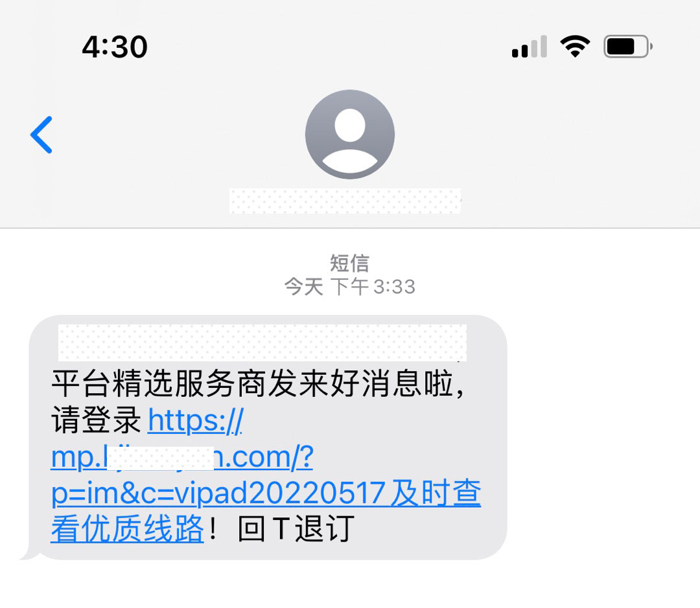
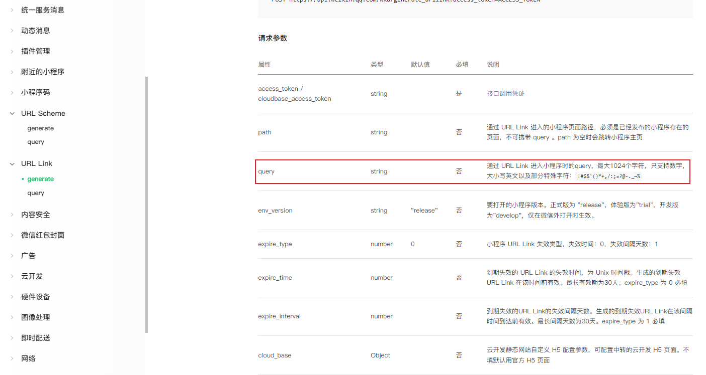

# 短信链接直接打开微信小程序踩坑

微信小程序出了个 URL Link 和 URL Scheme（Android系统不支持直接识别 URL Scheme，用户无法通过 Scheme 正常打开小程序，开发者需要使用 H5 页面中转，再跳转到 Scheme 实现打开小程序），可以用于短信、邮件、网页、微信内等拉起小程序的业务场景。

>生成的 URL Link 如下所示：https://wxaurl.cn/*TICKET* 或 https://wxmpurl.cn/*TICKET*，生成的 URL Scheme 如下所示：weixin://dl/business/?t= *TICKET*


但是后来可能发现好多人拿来滥用，然后就又出规则了：自 2022 年 4 月 11 日起，URL Link 和 URL Scheme有效期最长 30 天，不再支持永久有效的URL Link 和 URL Scheme，每个独立的URL Link 和 URL Scheme被用户访问后，仅此用户可以再次访问并打开对应小程序，其他用户无法再次通过相同URL Scheme打开该小程序。

这下要用那个跳转链接只能在触发短信的时候实时去不断生成唯一的链接才可以，不像以前生成一个固定的链接所有的用户都可以使用了，不过小程序的文档上也有说，[短信打开小程序有3钟方式](https://developers.weixin.qq.com/miniprogram/dev/framework/open-ability/sms.html)：① 通过URL Scheme实现 ② 通过URL Link实现 ③ 通过云开发静态网站实现。

最终经过评估，不依赖后端利用云开发一个静态中转页比较合适。运维在申请短信模板的时候，网址前后忘加空格了，然后导致网址路径后面带了一串中文参数，像下图的这样：



网址点进去中转页到是可以正常打开，但是点击“打开小程序”按钮无任何反映，最终在文档上找到了答案，原来是接口里的 query 参数有限制：**最大1024个字符，只支持数字，大小写英文以及部分特殊字符：!#$&'()*+,/:;=?@-._~%**




```js
// 获取小程序路径和参数
function getWxroute() {
  // 小程序路径与参数映射
  const pathMaps = {
    home: '/pages/index/home',
    im: '/pages/chat/list'
  }

  const query = getQuery()
  // 微信生成URL Link和URL Scheme的query部分：最大1024个字符，只支持数字，大小写英文以及部分特殊字符：!#$&'()*+,/:;=?@-._~%
  // https://developers.weixin.qq.com/miniprogram/dev/api-backend/open-api/url-link/urllink.generate.html
  let channelId = query.c || '' // 渠道ID
  channelId = channelId.replace(/[^A-Za-z0-9\!#\$&'\(\)\*\+\,\/\:;\=\?@\-\._\~%]/g, '')

  return {
    path: pathMaps[query.p || 'home'],
    query: `channelId=${channelId}`,
  }
}

// 获取路径中的参数
function getQuery(url = location.href) {
  const search = decodeURIComponent(url).split('?')[1] || ''
  const query = {}

  if (search) {
    const searchArr = search.split('&')
    let arr
    for (let item of searchArr) {
      if (!item) continue
      arr = item.split('=')
      query[arr[0]] = arr[1]
    }
  }

  return query
}
```


通过调试也确实发现参数里把路径中的中文也带进去了，接口返回的错误码也是文档上写的 40212（参数 query 填写错误），最终在获取参数那通过正则去除所有不支持的字符解决了。

**得到的教训：**

1、匹配网址或者短信中的链接要注意前后内容的处理  
2、URL Link 和 URL Scheme的query部分不支持中文参数

