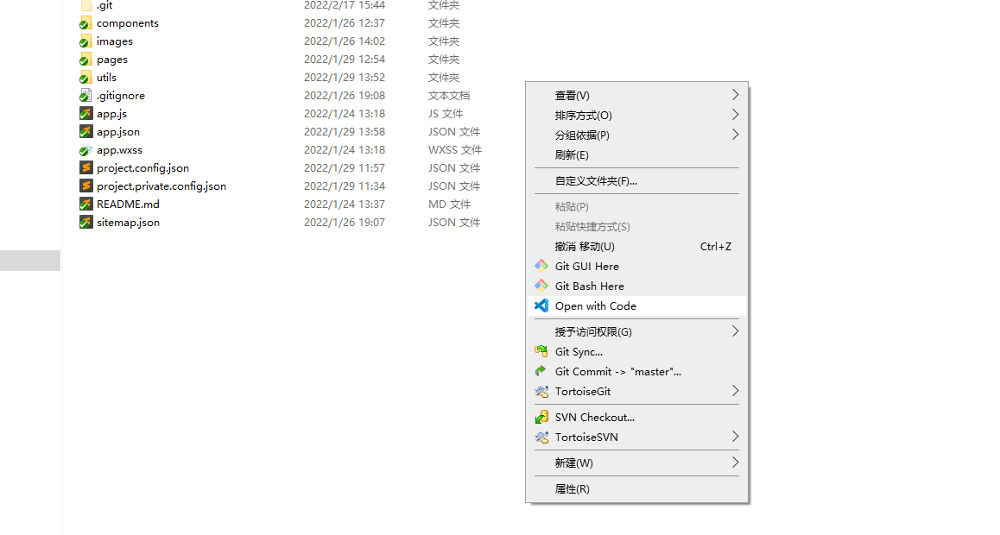
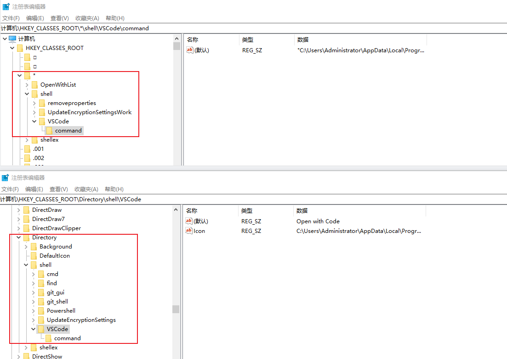

# windows右键菜单vscode打开当前目录

vscode 每次打开新项目都要先打开vscode在从里面打开目录，每次这样感觉效率比较低，就想着能不能有一个我直接在当前目录下右键菜单，点一下就直接用vscode打开当前目录，在网上搜了一下总共有3种方案：

1. 安装 vscode 的时候直接勾选上 Add "Open width Code" 那两个选项，默认应该是没勾选的，所以很多人就忽略了
2. 自己通过 win + R ，然后输入 regedit 进入到注册表里，自己去新增 vscode 的注册表，这种方式对不熟悉注册表操作的菜鸟不太友好
3. 其实是第二种的一个变种，只不过操作很简单，通过提前写一个 .reg 的注册表命令文件，点一下运行完就可以了

**下面就来看第3种菜鸟方法的实现步骤：**

### 1. 先找到你电脑上 vscode 的 .exe 安装路径
直接通过开始菜单里的 vscode - 打开文件位置，就能找到 vscode 的快捷方式位置，然后右键 - 属性 - 快捷方式 - 目标(T)，这个就是vscode的实际安装路径，复制出来这个路径，我的是：C:\Users\Administrator\AppData\Local\Programs\Microsoft VS Code\Code.exe

然后把路径里面的斜杠前面都再加一个斜杠，因为 \ 在正则里也是转义符，如果不在加一个会被直接忽略掉，我的修改后就是这样的：
C:\\Users\\Administrator\\AppData\\Local\\Programs\\Microsoft VS Code\\Code.exe

### 2. 新建一个 text 的记事本文件，将下面的内容复制进去
```text
Windows Registry Editor Version 5.00
    
[HKEY_CLASSES_ROOT\*\shell\VSCode]
@="Open with Code"
"Icon"="${你的vscode安装路径}"
    
[HKEY_CLASSES_ROOT\*\shell\VSCode\command]
@="\"${你的vscode安装路径}\" \"%1\""
    
Windows Registry Editor Version 5.00
    
[HKEY_CLASSES_ROOT\Directory\shell\VSCode]
@="Open with Code"
"Icon"="${你的vscode安装路径}"
    
[HKEY_CLASSES_ROOT\Directory\shell\VSCode\command]
@="\"${你的vscode安装路径}\" \"%V\""
    
Windows Registry Editor Version 5.00
    
[HKEY_CLASSES_ROOT\Directory\Background\shell\VSCode]
@="Open with Code"
"Icon"="${你的vscode安装路径}"
    
[HKEY_CLASSES_ROOT\Directory\Background\shell\VSCode\command]
@="\"${你的vscode安装路径}\" \"%V\""
```

### 3. 将文本里面的 ${你的vscode安装路径} 替换成你自己的实际路径
就是上面咱多加了一个 \ 后的那个 vscode 安装路径，总共有6处需要替换的

### 4. 将这个修改好的 .text 文件的文件后缀名直接改成 .reg
修改好后缀后，直接双击这个文件，提示什么的直接选是就可以了，没影响，然后点完之后在右键菜单里就会发现多了一个 vscode 的选项，然后点击就可以直接打开当前目录了。



这个时候你再去win + R ，然后输入 regedit 进入到注册表里看也能看到，这种方式也就是把第二步的自己修改注册表的操作傻瓜化了



然后其他的软件自己也可以通过类似方式举一反三，往右键菜单里添加了，工作效率迅速又提高了。