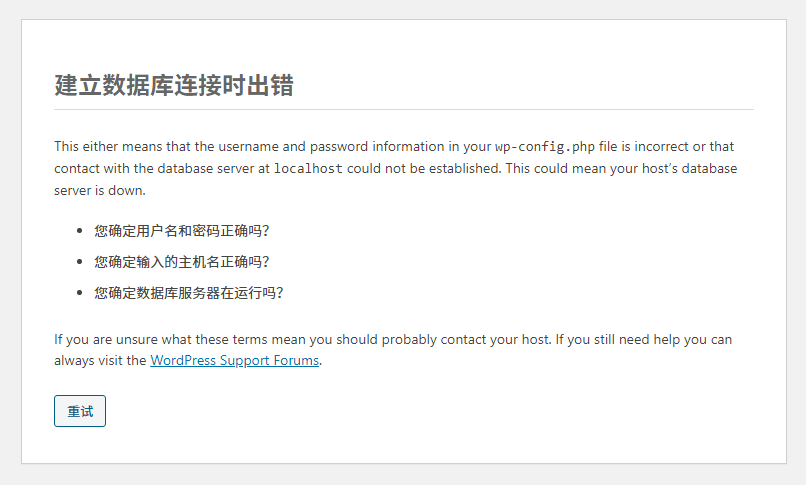
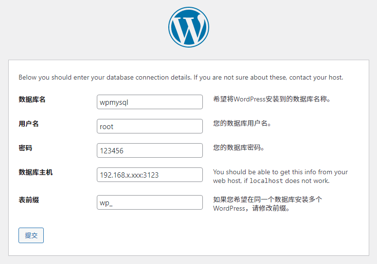

# 用Docker搭建运行本地WordPress

**为什么会有这样的需求**

WordPress需要部署在服务端，如果我们只是为了看下效果或者测试开发使用，那就需要直接部署在本地。而我之所以想要在本地部署也是因为打算开发一个WordPress 的插件，在服务器上搭建和测试插件太不方便了。按照以前的思路是需要在本地安装 phpStudy、XAMMP 这类服务器软件，现在有了Docker 可就方便多了，只用安装相应镜像跑起来就可以了。

**搭建步骤**

1. 本地安装好 Docker 软件（下面的操作都是基于 Windows 10）
2. 拉取 WordPress 镜像
```bash
docker pull wordpress
```
3. 拉取 WordPress 镜像
```bash
# 也可以拉取具体的版本 docker pull mysql:5.2
docker pull mysql
```
4. 启动 MySQL 容器
```bash
docker run -d -p 3123:3306 --name wpmysql -e MYSQL_ROOT_PASSWORD=123456 mysql

# run: 启动一个容器
# -d: 启动的容器在后台运行
# --name: 容器名 wpmysql
# -e MYSQL_ROOT_PASSWORD:  设置 MySQL 的 root 密码
# -p：映射端口，将容器的3306端口映射到主机的3123端口（为了防止冲突不要直接用3306）
# mysql：启动的镜像，如果具体版本，这里也要加上具体版本号 mysql:5.2
```

5. 启动 WordPress 容器，并连接到 MySQL 容器上
```bash
docker run -d -p 8088:80 --name wordpress --link wpmysql:mysql wordpress
# -p：映射端口，本地访问路径：http://localhost:8088
# --link：将 wpmysql 容器挂载到 mysql 上，这样 WordPress 才能访问
```

不出意外的话，在浏览器打开后设置好数据库信息看到的是这样的：



**解决方案**

```bash
# 1.查看容器运行状态
docker ps

# 2.进入mysql容器
docker exec -it mysql bash

# 3.登录mysql
mysql -uroot -p

# 4.授权root用户在其他机器上运行：host为 % 表示不限制ip，默认的localhost表示本机使用
grant all on *.* to 'root'@'%';

# 5.如果是 mysql8 版本，由于不支持动态修改密码验证，还需要更新root用户密码
alter user 'root'@'%' identified with mysql_native_password by '123456';

# 6.刷新权限
flush privileges;
```

经过上面的设置后应该就可以正常连接了，注意数据库地址要填本机的 ip 地址加上端口号，在 C:\Windows\System32\drivers\etc 里的 hosts 文件里也能看到 Docker 添加的 ip 映射：# Added by Docker Desktop）


之后看到这就代表部署成功了，撒花~~~

