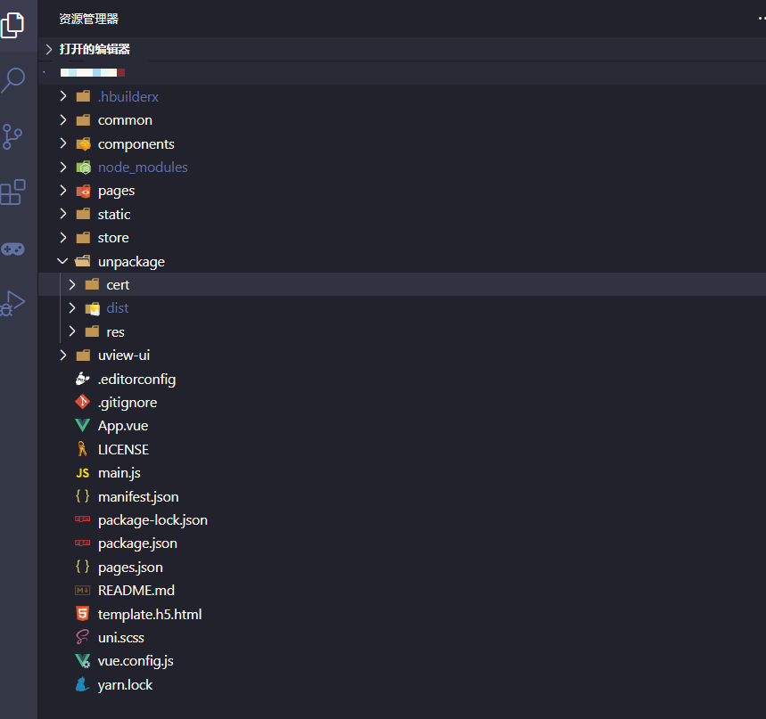
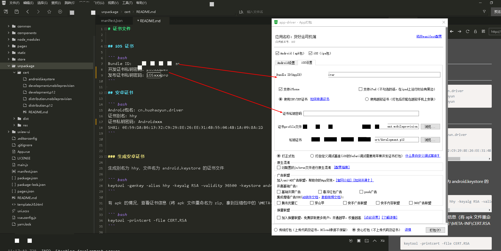

# 各端开发打包发布完整指南

## 一、uni-app项目介绍
用uni-app开发项目，一套代码可同时打包出各端小程序、h5和app，uni-app支持通过 HBuilderX可视化界面 和 vue-cli命令行 两种方式创建项目，下面示例项目采用 HBuilderX可视化界面 的方式创建：

```bash
├── common           api文件  
├── components       公用组件  
├── uview-ui         UI框架  
├── static           本地静态资源，注意：静态资源只能存放于此  
├── store            状态管理  
├── manifest.json    配置应用名称、appid、logo、版本等打包信息，详见  
├── pages.json       配置页面路由、导航条、选项卡等页面类信息  
├── pages            页面文件  
└── unpackage  
    ├── res          图标、启动页  
    ├── cert         APP证书文件  
    └── dist         打包的文件  
```



## 二、开发工具HBuilderX
HBuilderX，简称HX，是轻如编辑器，强如IDE的合体版本，有点像vscode和小程序开发工具的结合体，顶部菜单栏有一个“运行”和“发行”的菜单，直接点击：运行 —— 运行到内置浏览器，可以直接像在浏览器里一样调试。

发布App时，需要使用HBuilderX，其他开发工具无法发布App，但可以发布H5、各种小程序。如需开发App，可以先在HBuilderX里运行起来，然后在其他编辑器里修改保存代码，代码修改后会自动同步到手机基座。HBuilderX下载地址：https://www.dcloud.io/hbuilderx.html

## 三、小程序和H5打包
各平台的配置可以直接在manifest.json里配置，或者在HBuilderX开发工具里选中manifest.json文件，右侧会出现图形化界面直接选择配置


先运行起来，然后点击：发行 - 小程序/网站 - 设置小程序/网站名字/appid/域名

打包成功后可以在dist - build 文件夹下找到对应平台的打包文件


## 四、安卓应用打包
1、点击：发行 - 原生App-云打包

2、按照unpackage/cert目录下的README.md说明填写：

Android包名、证书别名、证书私钥密码、选择证书文件（直接点浏览按钮，选到 unpackage/cert 目录）

3、点击打包按钮


## 五、IOS应用打包
1、点击：发行 - 原生App-云打包

2、按照unpackage/cert目录下的 README.md 说明填写：

Bundle ID(AppID)、证书私钥密码、证书profile文件和私钥证书（直接点浏览按钮，选到 unpackage/cert 目录）

3、点击打包按钮



使用云打包点击了打包按钮后，需要等待一段时间，少则几分钟，多则大半天...最终打包成功后会在控制台打印出app安装文件的下载地址：


Android：apk文件，直接点击“打开所在目录”，生成的apk文件在 unpackage/release/apk文件夹下

IOS:  ipa文件，直接点击“下载地址”，远程下载到本地

打包证书相关资料：

[Android平台云端打包证书使用说明](https://ask.dcloud.net.cn/article/35985)

[Android平台云端打包 - DCloud公用证书（DCloud老版证书）](https://ask.dcloud.net.cn/article/68)

[Android平台签名证书(.keystore)生成指南](https://ask.dcloud.net.cn/article/35777)

[iOS证书(.p12)和描述文件(.mobileprovision)申请](https://ask.dcloud.net.cn/article/152)

## 六、发布上线
1、小程序  
直接用小程序开发者工具导入 dist - build 文件夹下对应的目录，如微信小程序：dist/build/mp-weixin

2、H5  
和web网站一样，将最终打包出来的H5文件部署到线上：dist/build/h5

3、Android
* 最终生成的apk文件，可以直接用聊天工具发送到安卓手机上安装使用
* 去注册各大安卓应用市场账号，上传到应用市场供用户下载
* 也可以自己开发一个发布页，将安卓apk放到项目里，用户点击直接下载到手机里，如果设备是ios还可以直接判断让跳转到appstore下载地址

4、IOS  
① 正式版本

ios正式应用只能从app store里下载，需要先注册苹果开发者账号，填写各项应用资料，上传ipa文件审核通过后才能下载使用


② 测试版本

ios-app测试时，将ipa文件上传到蒲公英上：https://www.pgyer.com/

用有授权的苹果手机扫描二维码在Safari浏览器里打开即可直接下载安装，或者直接在safari浏览器中输入“下载地址”

## 七、windows下生成安卓证书
Android平台打包发布apk应用，需要使用数字证书（.keystore文件）进行签名，用于表明开发者身份，Android证书的生成是自助和免费的，不需要审批或付费。

可以使用JRE环境中的keytool命令生成，以下是windows平台生成证书的方法：

1、安装JRE环境  
可从Oracle官方下载jre安装包：https://www.oracle.com/technetwork/java/javase/downloads/index.html（记住安装的路径，后面生成证书的时候要用到）

2、打开命令行（cmd），可以先切换到要生成的目录下，我直接在D盘根目录下生成输入：
```bash
d:
```

3、将JRE安装路径添加到系统环境变量，我的JRE装在D盘下 "D:\Programs\jre\bin"

```bash
set PATH=%PATH%;"D:\Programs\jre\bin"
```
注意这里安装路径不要写错了，我这里刚开始路径里 Programs 就少了个s，后面就一直报错：keytool不是内部或外部命令，也不是可运行的程序

4、使用keytool -genkey命令生成证书

```bash
keytool -genkey -alias testalias -keyalg RSA -keysize 2048 -validity 36500 -keystore android.keystore
```

* testalias：是证书别名，可修改为自己想设置的字符，建议使用英文字母和数字
* android.keystore：是证书文件名称，可修改为自己想设置的文件名称，也可以指定完整文件路径
* 36500：是证书的有效期，表示100年有效期，单位天，建议时间设置长一点，避免证书过期


按提示输入信息后就会在D盘根目录下生成 android.keystore 文件，这个文件就可以用来直接打包安卓app了


