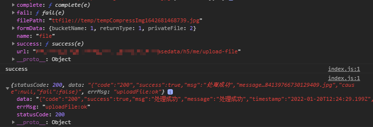
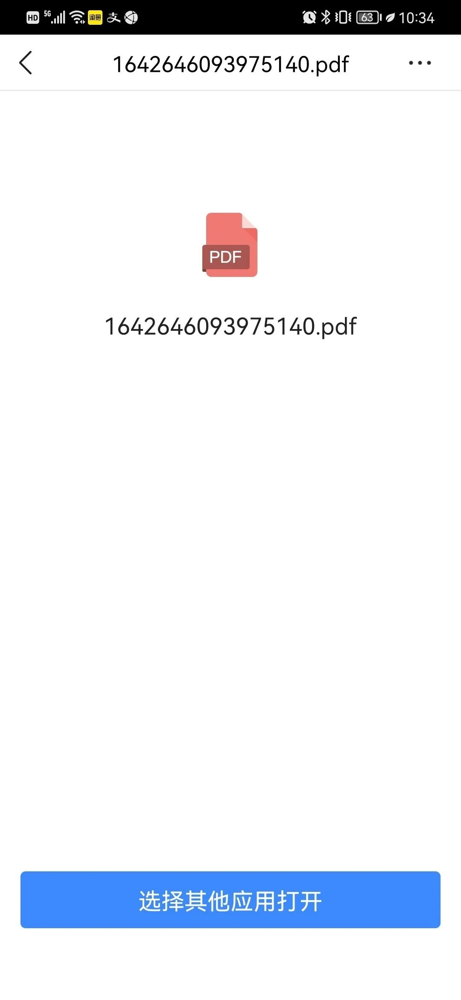

# 开发字节抖音小程序踩坑记

用uni-app开发多端应用，之前打包的微x小程序好好的，打包成字节的就各种兼容问题，UI框架用的uView的1.x版本，也是各种兼容问题：

[[toc]]

## 一、上传图片上传不了
上传图片用 uni.chooseImage 选中图片后，得到的本地临时路径是个这样的：ttfile://temp/ab790db96c9b65cb54685c7d99c4d847.jpeg

直接用这个路径通过 uni.uploadFile 接口上传，会上传不了
解决办法：要用 uni.compressImage 这个压缩图片的接口去压缩下，再用获取到的路径去上传就可以了：
ttfile://temp/tempCompressImg1642681468739.jpg

对比了下两次获取到的本地路径就中间的文件名部分不一样，微x小程序就没这个问题

## 二、用web-view展示pdf文件在安卓上不显示
页面用web-view来展示pdf文件，在ios和开发工具里都没问题，但在安卓手机上页面打开成功一直显示空白，解决方案先用 uni.downloadFile 下载下来文件，在通过 uni.openDocument 打开文档，但是安卓真机上打开依然只显示一个pdf文件名，需要自己再点一下通过wps之类的其他第三方应用打开

## 三、子组件传递事件$emit里的事件名不能加“-”
子组件像父组件传递事件时，事件名里加了横杠“-”编译之后事件都是无效的，像下面这样的：this.$emit('on-pick', info)，要改成 this.$emit('onpick', info) 才有用

## 四、子组件里多个slot编译无效
自己封装的组件里有多个 slot 的都编译不出来，uview的很多组件也一样有问题

## 五、勾选了es6转es5，lodash里用到的函数报错
一般我们都会勾选上es6转es5，页面里如果有用到 lodash库里防抖节流函数 debounce、throttle会直接报错，如果不转则没问题

## 六、安卓小程序点击空白让输入框键盘收起会触发2次页面的点击事件
有个页面正好有用到输入框和uview的步进器，先点击输入框获取焦点同时键盘弹出，如果此时正好直接去点步进器的 + 或 - 会直接加减2
解决办法：设置个变量去禁掉步进器 disabled，输入框获取焦点focus事件里去设置disabled=true，burl事件里用个定时器设置disabled=false，这样用户要自己先点一下空白收起键盘后，才能点击步进器

## 七、uni.getEnv方法字节小程序不支持
小程序里web-view可以直接用uni.navigateTo之类的接口跳回小程序或者和小程序通信，单需要在网页里引入对应平台提供的通信sdk文件，像获取环境信息的 uni.getEnv 方法字节小程序里是不支持的

## 八、uni-app打包优化
uni-app打包一般会根据环境变量来自动设置接口域名，但是uni只有生产模式production才会压缩代码，有时我们开发、测试环境也需要真机上预览，如果不压缩代码有时会提示包超除大小限制（一般主包限制2M）
解决方案：通过默认的 NODE_ENV 命令行变量去让打包生产模式，自己再额外加一个VUE_APP_ENV变量来判断接口地址，如下面这样的命令：
"build:mp-toutiao-dev": "cross-env VUE_APP_ENV=development NODE_ENV=production UNI_PLATFORM=mp-toutiao vue-cli-service uni-build --minimize --watch"

## 九、获取用户手机号授权需提前申请
抖音小程序获取用户手机号的api需要企业主体，而且要先申请审核通过了才可以用