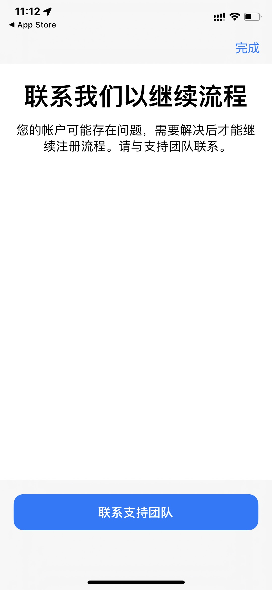
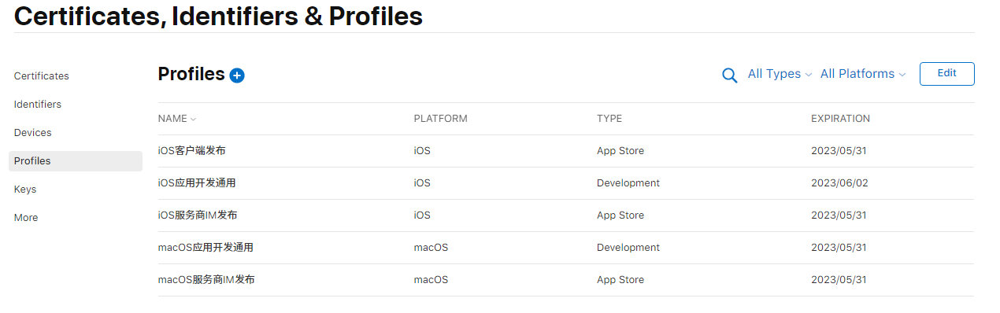
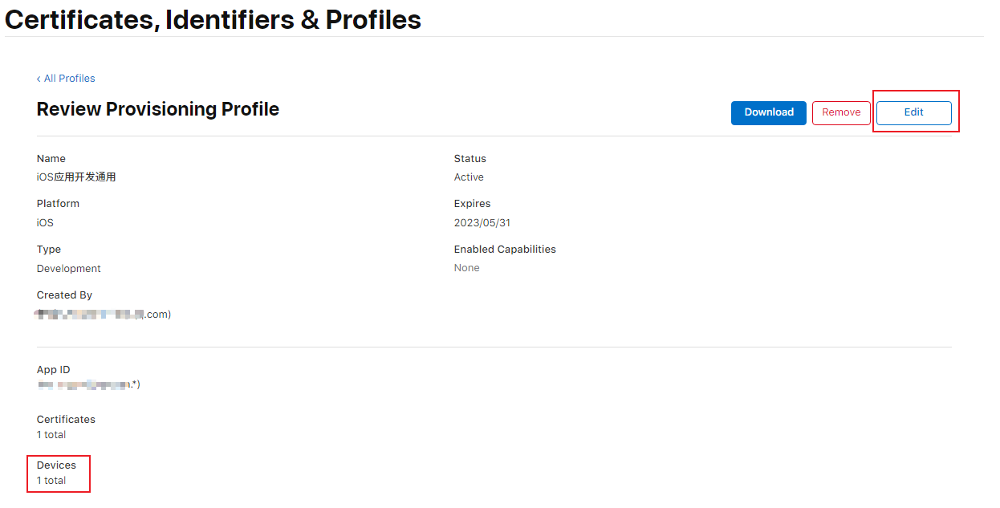
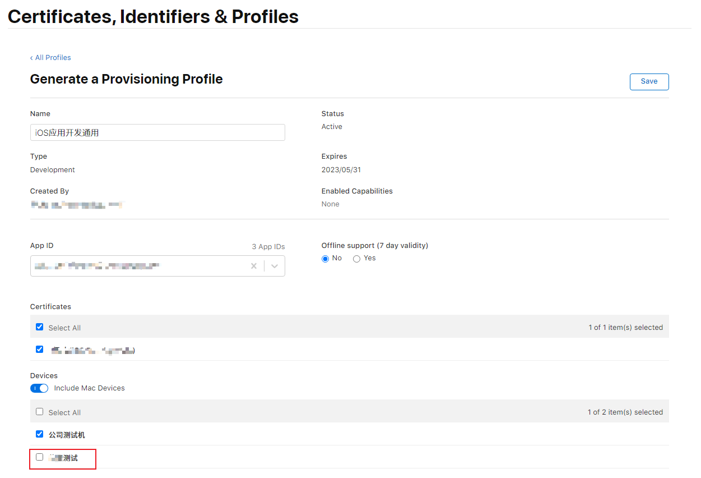
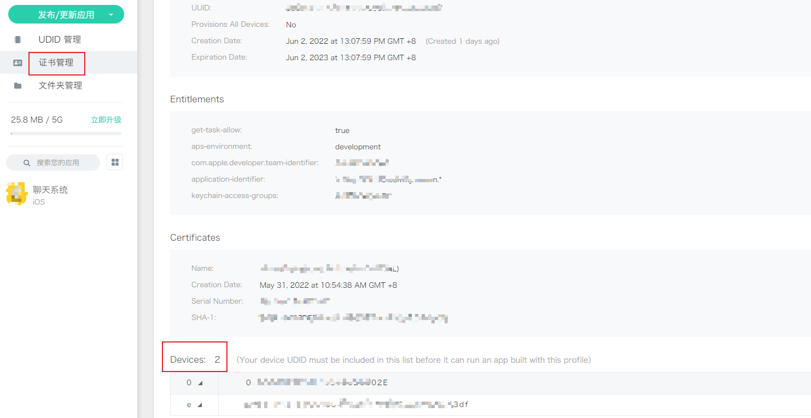
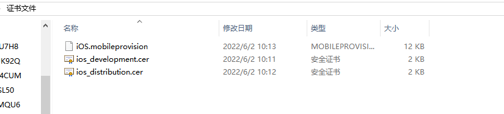

# 开发打包ios应用

## 获取iphone手机的UDID

**UDID**：iOS 设备的一个唯一识别码，每台 iOS 设备都有一个独一无二的编码，这个编码，我们称之为识别码，也叫做UDID（ Unique Device Identifier）。

之所以要获取这个东西，因为在真机上调试和开发时，需要在苹果开发者中心添加了的设备才可以安装和预览应用。

> Your device has been registered and can now be included in provisioning profiles for app development and installation. Registered devices are also eligible to install pre-release versions of iOS.(您的设备已注册，现在可以包含在用于应用程序开发和安装的配置文件中。 已注册的设备也有资格安装 iOS 的预发布版本。)

**获取方式**：通过 [蒲公英网站获取](https://www.pgyer.com/udid)


## 申请开发者账号

可以申请个人的和企业的，需要支付 $99，企业的还需要邓白氏码，注意第一次申请的时候，千万不要申请了一半，然后换另外一台设备，辣鸡苹果会认为你是在倒卖开发者账号，然后你就会神奇地发现，你的账号会一直出现提示：你的账号可能存在问题...



之后不管你怎么发邮件、打客服电话、求爹爹告奶奶申诉都没用，你的账号、设备和身份信息都已经被 Apple 拉黑了，如果你也不幸中招，我劝你不要留念，赶紧找个新设备新身份申请个新账号重新注册，其他的一切都是无用功。


## plus is not defined

>uni-app App 端内置 HTML5+ (opens new window)引擎，让 js 可以直接调用丰富的原生能力，小程序及 H5 等平台是没有 HTML5+ 扩展规范的，因此在 uni-app 调用 HTML5+ 的扩展规范时，需要注意使用条件编译。否则运行到h5、小程序等平台会出现 plus is not defined错误

```js
let cid = ''
// #ifdef APP-PLUS
cid = plus.push.getClientInfo().clientid
// #endif
```


上面的代码还有一个坑，因为使用了 plus.push，要在 manifest 里勾选上 push 模块，否则 app 上打开时会一直提示：打包时未添加 Push 模块，同时还需要在 uni 的开发后台申请开 [UniPush](https://uniapp.dcloud.net.cn/tutorial/app-push-unipush.html)。

[uni-app使用plus注意事项](https://uniapp.dcloud.io/tutorial/use-html5plus.html)

## 无法安装此 App，因为无法验证其完整性


网上有说打开手机：设置-通用-设备管理-安装证书...反正 ios 15+ 里没找到安装的地方。

这种情况是当前设备没有开发和调试权限导致的，要去苹果开发者后台 Devices 里把你手机的 UDID 添加到里面。


设备添加之后，还需要去更新描述文件 Profiles，刚开始我以为直接重新下载描述文件打包就可以了，实际上是不行的。还需要去更新描述文件里里面的设备，开发环境我这里是去改那个“iOS应用开发通用”，点进去：



发现描述文件详情里面的设备 Devices 那果然只有之前添加的一个，新加的设备没包含在里面，然后点击右上角的 Edit:



把最底下的那个新加的设备勾选上



之后在重新下载这个描述文件，可以传到蒲公英的证书管理里看下有没有生效，我这里显示2台设备，说明已经可以了：



在重新用 HBuilderX 云打包，在更新到蒲公英上，然后手机扫码重新安装，这下就可以正常打开了。


下面截图的第一个就是从苹果开发者后台下载下来的描述文件，后两个是开发和发布的证书文件（需要在mac里用密码钥匙串导出成 p12 文件才可以用来打包），添加设备后证书文件不用去更新，只用更新第一个 iOS.mobileprovision 描述文件：

