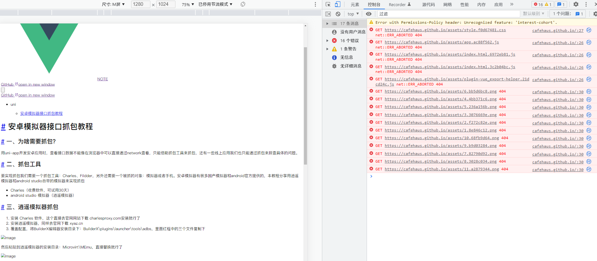

# 用vuepress2搭建自己的github网站

最近打算自己做一个博客网站记笔记，然后部署到github上，最终选择了vuepress的最新版本v2（使用的是vue3和TypeScript开发，默认使用Vite作为打包工具）。

[[toc]]

## 一、根据官方示例搭建项目

直接根据官方文档先初始化项目就行了，注意文档的版本，v1和v2还是有很多地方不同的。

## 二、将代码推到github上

最终我们是要部署到github上，所以直接在github上新建一个自己的项目仓库就好了

## 三、用 GitHub Actions 部署到 GitHub Pages

具体的各个站点和CI工具的部署，vuepress文档上也有写，我们这里选择用 GitHub Actions 部署到 GitHub Pages，根据步骤直接操作就行了，需要注意的几个地方：

1、官方提供的GitHub Actions脚本可以直接复制用，直接在默认的main分支根目录新建 .github/workflows/docs.yml 文件来配置工作流，注意如果你就改了默认分支名比如master，脚本里的main也要同步改下；

2、文档上写的项目自动生成的打包命令是：yarn docs:dev和yarn docs:build，实际使用中我们往往会直接改成 yarn dev和yarn build，如果改了GitHub Actions里的打包命令也要同步改下；

3、仓库里的Pages设置分支要选到gh-pages分支，后面的一项直接选根目录/(root)，切记最后要点一下后面的save保存，否则不生效哟；

4、如果输入直接的网站地址打开发现是404，就是没部署成功

去代码仓库的Actions里去看下流水线有没有成功，失败了会是一个红色的小叉叉，点进去可以看到具体的错误位置，成功了是一个绿色的小勾

流水线成功了gh-pages分支里就会自动生成最终打包出来的文件，像下面这这样的：

5、如果部署成功了，但是发现样式和交互都不生效，基本就是css、js和图片等静态资源路径有问题，就是文档上第一步说明的，如果代码仓库名不是和自己账号名相同（* 相同的话最后访问地址是这样的 https://USERNAME.github.io/，不同的话是要在后面加上仓库名 https://USERNAME.github.io/REPO/）

解决方法：在 docs/.vuepress/config.js 里将部署站点的基础路径 base 设置为仓库名就可以了，注意前后要加/，示例：base："/REPO/"。

::: tip 提示
项目里本地引用的图片这类静态资源尽量都用相对路径，vuepress打包的时候会根据 base 自动处理。

base（部署站点的基础路径） 这个参数你根据名字也能看出来最后是针对部署到服务器上用的，所以本地直接打包yarn build出来的文件用一些第三方的插件如：serve直接运行可能会出错，因为base没生效，要本地查看build效果base可以先设置成默认的 "/"。
:::

## 四、vuepress v2版本的坑
最新的v2版本和v1有很大的不同，网上大部分的教程都是针对v1版的，在v2中并不起作用。

**1. 模块化**

有的地方使用import导入文件会报错，如config.js里的配置，这里导出配置用的 module.exports，本身就是node的CommonJS模块规范导出规范，导入要用require来引入（当你在开发一个 VuePress 应用时，由于所有的页面在生成静态 HTML 时都需要通过 Node.js 服务端渲染）

**2. vue组件中使用CommonJS的require导入报错**

vuepress最新的v2版本默认打包方式是Vite（只支持 ES 规范，不支持 CommonJS 规范），在组件中直接用CommonJS的require其他文件会报错：ReferenceError: require is not defined，vue3的官方文档上也有介绍：
> Vite 是一个 web 开发构建工具，由于其原生 ES 模块导入方式，可以实现闪电般的冷服务器启动

**3. markdown中使用vue组件**

v2版本中像v1所谓的“主题目录结构约定”不再存在，所以 .vuepress/components下的组件并不会被自动全局注册，需要自己手动注册或者借助 @vuepress/plugin-register-components 插件来配置