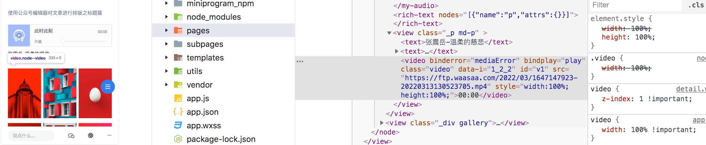
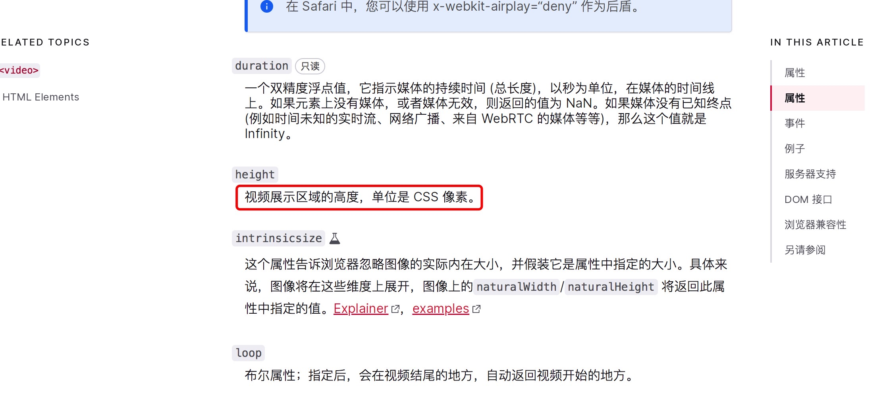

# video视频高度设置百分比在微信小程序中直接不显示

下面的视频标签height设置成百分比，在微信小程序中解析出来压根不显示，直接审查元素发现video的高度是0：

```html
<div class="video-box">
  <video src="https:xxx.com/54321.mp4" width="100%" height="100%" />
</div>
```


微信小程序video组件默认是 width:300px，height:225px，但是如果有设置width和height会覆盖掉默认值，开始我以为是用百分比设置height这种写法不规范，或者不支持百分比设置高度。

从网上的一些文档上包括最权威的MDN，都说明了height的单位是CSS像素，难道是真的不支持百分比？



但是呢，和height对应的width又是支持百分比的，实际去设置成不同的值也是有效的，不支持这个假设看来是不成立了。

接着继续去浏览器里找找原因，同样的代码在浏览器中神奇的可以显示出视频来，但是直接去修改height的百分比值是无效的。


**到这里大概能得出结论：**

1、video的height设置百分比在浏览器和小程序中都是无效的
2、浏览器会去默认处理video的百分比高，让video正常显示
3、小程序会用百分比覆盖掉video组件默认的height:225px，视频不显示

还额外发现一点，浏览器中height的默认单位是px，如果数值后面跟的是其他任何字符，如：#、vh、xx...谷歌浏览器都会默认给转成px，但是 % 却不会转，那从这也说明video的高度肯定是支持百分比的。

在回过头来看上面的代码，其实我们一直忽视了video组件的父级元素 video-box，height设置成百分比本来就是相对父级元素的百分比，如果父级元素没有高度值也就是 height:0，那子元素的height设置成任何的百分比也都是0。

实际在小程序和浏览器里验证，也确实是如此，只要给父元素设置一个具体的高度，那video的height设置成百分比是有效的。

